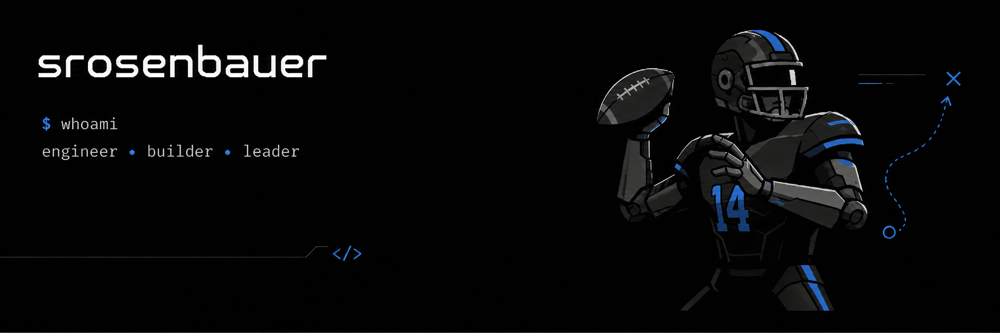

---

## Hey, I'm Seth Rosenbauer 👋

I'm an engineering leader who never stopped writing code, with a background in **data engineering** and a current obsession with agentic coding workflows. Most days I'm pairing with **Claude Code** on something, figuring out how to get real leverage out of AI tooling on production codebases without losing the rigor that makes software actually work. I work across **C#**, **TypeScript**, **Node.js**, **React**, **Java**, **Python**, and **SQL**, and I believe the engineers and leaders who'll matter most over the next few years are the ones who can fluently direct AI, not just prompt it.

  

     

---

        
